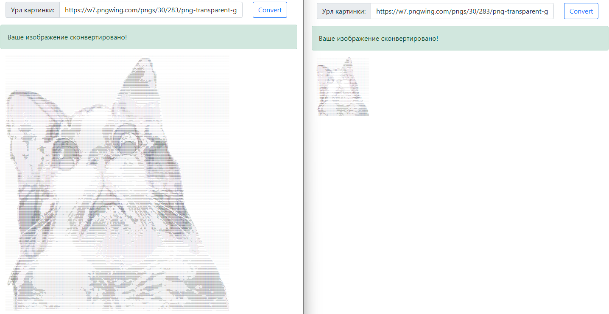

# Конвертер в текстовую графику

Приложение, конвертирующее изображения в текстовую графику (т. е. в текст из разных символов, которые в совокупности выглядят как изображение). Пример результата работы:


## Структура проекта
Перед вами java-проект

| Класс / Интерфейс      | Для чего? |
| ----------- | ----------- |
| `BadImageSizeException`      | Класс исключения      |
| `TextColorSchema`   | Интерфейс цветовой схемы     |
| `TextGraphicsConverter`   | Интерфейс конвертера картинок       |
| `TextGraphicsConverter`   | Класс конвертера картинок (реализация интерфейсов)      |
| `GServer`   | Класс сервера      |
| `Main`   | Запуск приложения. В нём запускается сервер, также в нём можно конвертировать картинки в текстовые файлы без сервера        |

## Принцип работы
Приложение принимает URL картинки, передает в виде текста, качает и анализирует картинку, после чего отдаёт значение типа `String`, в котором содержится это изображение в виде текстовой графики.

В итоге мы видим такой результат, где более тёмные участки заменяются на более жирные символы, а светлые на более незаметные символы:


Также конвертер в серверной части имеет возможность выставлять ему настройки перед конвертацией:
- максимально допустимое соотношение сторон (ширины и высоты).
- максимально допустимую высоту итогового изображения.
- максимально допустимую ширину итогового изображения.
- текстовую цветовую схему — объект специального интерфейса, который будет отвечать за превращение степени белого (числа от 0 до 255) в символ. 

Используемая цветовая схема по умолчанию:
```
  List.of('#', '$', '@', '%', '*', '+', '-', '\'')
```

```java
  this.converter.setMaxHeight(300);
  this.converter.setMaxWidth(300);
  this.converter.setMaxRatio(4);
```

```java
  this.converter.setMaxHeight(300);
  this.converter.setMaxWidth(70);
  this.converter.setMaxRatio(4);
```

